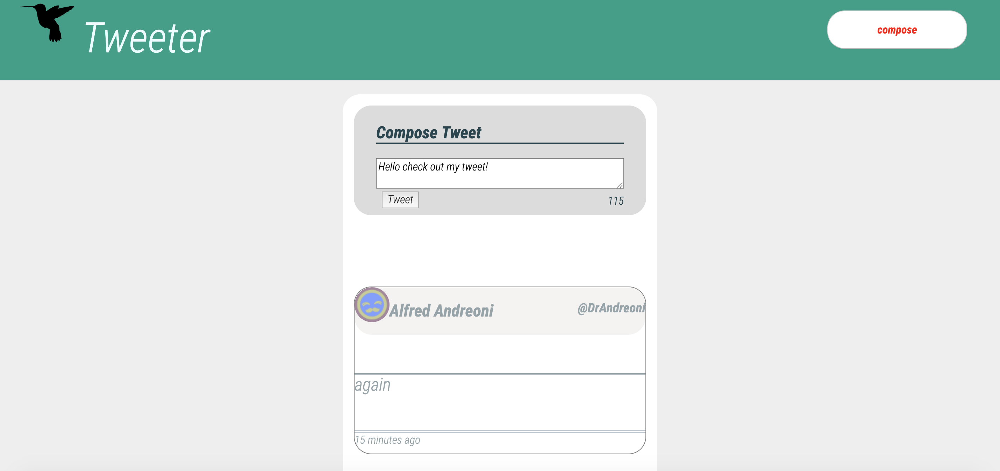

# Tweeter Project

Tweeter is a simple, single-page Twitter clone. It is a single page app that is built with HTML, CSS, JS, jQuery and Ajax for the front end using MongoDB and node for the back end skills.

## Getting Started

1. Fork this repository, then clone your fork of this repository.
2. Install dependencies using the `npm install` command.
3. Start the web server using the `npm run local` command. The app will be served at <http://localhost:8080/>.
4. Go to <http://localhost:8080/> in your browser.

## Dependencies

    "dependencies": 
    
    "body-parser": "^1.15.2",
    "chance": "^1.0.2",
    "express": "^4.13.4",
    "md5": "^2.1.0",
    "mongodb": "^2.2.36"
  

## What The App looks like

